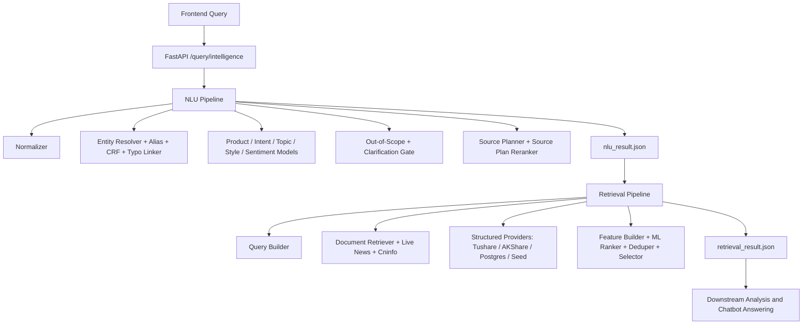

# ARIN Query Intelligence

ARIN Query Intelligence is the repository module responsible for query understanding and evidence retrieval. It accepts a frontend user query and produces two JSON artifacts:

- `nlu_result.json`: normalized query, product type, intent, topic, entities, missing slots, risk flags, evidence requirements, and source plan.
- `retrieval_result.json`: executed sources, document evidence, structured market/fundamental/macro data, coverage, warnings, and ranking/debug traces.

This module does not generate the final chatbot answer and does not make investment conclusions. Downstream modules should consume the two JSON outputs for document learning, sentiment analysis, trend analysis, numerical feature computation, and response generation.

## Scope

Current scope is China market v1:

- A-share stocks: price, news, announcements, financials, industry, fundamentals, valuation, risk, comparison.
- ETF / funds: NAV, fixed investment, fees, subscription/redemption, product mechanics, ETF/LOF/index-fund comparison.
- Index / market / sectors: CSI 300, SSE Composite, sector indexes such as liquor or semiconductors.
- Macro / policy / indicators: CPI, PMI, M2, treasury yields, rate cuts, policy impact.
- Financial question styles: why up/down, whether to hold, whether to buy, which is better, fundamentals, risk.

HK/US stocks and overseas products are not guaranteed by default. To support them in production, add runtime entities, aliases, structured providers, document sources, and matching training/evaluation cases.

## Quick Start

Use Python 3.13 or a compatible Python 3 version. Commands below assume you are running from the repository root.

```bash
# Interactive manual query test
python manual_test/run_manual_query.py

# One-shot manual query
python manual_test/run_manual_query.py --query "你觉得中国平安怎么样？"

# Start FastAPI
uvicorn query_intelligence.api.app:create_app --factory --host 0.0.0.0 --port 8000

# Start FastAPI with live providers
QI_USE_LIVE_MARKET=1 QI_USE_LIVE_NEWS=1 QI_USE_LIVE_ANNOUNCEMENT=1 \
uvicorn query_intelligence.api.app:create_app --factory --host 0.0.0.0 --port 8000
```

Manual test output:

```text
manual_test/output/<timestamp>-<query-slug>/
  query.txt
  nlu_result.json
  retrieval_result.json
```

## API

API code is in `query_intelligence/api/app.py`; request/response contracts are in `query_intelligence/contracts.py`.

| Endpoint | Purpose | Input | Output |
|---|---|---|---|
| `GET /health` | Health check | none | `{"status":"ok"}` |
| `POST /nlu/analyze` | NLU only | `AnalyzeRequest` | `NLUResult` |
| `POST /retrieval/search` | Retrieval from an existing NLU result | `RetrievalRequest` | `RetrievalResult` |
| `POST /query/intelligence` | End-to-end NLU + Retrieval | `PipelineRequest` | `PipelineResponse` |
| `POST /query/intelligence/artifacts` | End-to-end run and write JSON artifacts | `ArtifactRequest` | `ArtifactResponse` |

### Frontend Request JSON

Recommended endpoint: `POST /query/intelligence`. Use `POST /query/intelligence/artifacts` if the backend should also write files.

```json
{
  "query": "你觉得中国平安怎么样？",
  "user_profile": {
    "risk_preference": "balanced",
    "preferred_market": "cn",
    "holding_symbols": ["601318.SH"]
  },
  "dialog_context": [
    {
      "role": "user",
      "content": "我持有中国平安"
    },
    {
      "role": "assistant",
      "entities": [
        {
          "symbol": "601318.SH",
          "canonical_name": "中国平安"
        }
      ]
    }
  ],
  "top_k": 10,
  "debug": false
}
```

| Field | Type | Required | Description |
|---|---:|---:|---|
| `query` | string | yes | Raw user query. Must not be empty. |
| `user_profile` | object | no | User metadata such as holdings, risk preference, or preferred market. |
| `dialog_context` | array | no | Multi-turn context, previous entities, or clarification state. |
| `top_k` | integer | no | Retrieval output limit, 1 to 100, default 20. |
| `debug` | boolean | no | Enables extra debug traces. Keep `false` in production unless debugging. |
| `session_id` | string | artifacts only | Frontend session ID for artifact metadata. |
| `message_id` | string | artifacts only | Frontend message ID for artifact metadata. |

`POST /retrieval/search` accepts:

```json
{
  "nlu_result": {
    "...": "full NLUResult JSON"
  },
  "top_k": 10,
  "debug": false
}
```

## Output 1: NLUResult

Important fields:

| Field | Type | Description |
|---|---:|---|
| `query_id` | string | UUID shared by the NLU and retrieval outputs. |
| `raw_query` | string | Raw frontend query. |
| `normalized_query` | string | Normalized query text. |
| `question_style` | enum | `fact`, `why`, `compare`, `advice`, `forecast`. |
| `product_type` | object | Single-label product prediction with `label` and `score`. |
| `intent_labels` | array | Multi-label intent predictions. |
| `topic_labels` | array | Multi-label topic predictions. |
| `entities` | array | Entity resolution results. A-share/ETF/fund/index entities should carry `symbol` when possible. |
| `comparison_targets` | array | Targets in comparison queries. |
| `keywords` | array | Retrieval keywords. |
| `time_scope` | enum | `today`, `recent_3d`, `recent_1w`, `recent_1m`, `recent_1q`, `long_term`, `unspecified`. |
| `forecast_horizon` | string | Forecast or holding horizon. |
| `sentiment_of_user` | string | User tone sentiment, usually `positive`, `neutral`, or `negative`. |
| `operation_preference` | enum | `buy`, `sell`, `hold`, `reduce`, `observe`, `unknown`. |
| `required_evidence_types` | array | Evidence requirements for downstream modules. |
| `source_plan` | array | Sources that retrieval should execute. |
| `risk_flags` | array | Flags such as `investment_advice_like`, `out_of_scope_query`, `entity_not_found`. |
| `missing_slots` | array | Missing slots such as `missing_entity`. |
| `confidence` | float | Overall NLU confidence. |
| `explainability` | object | Matched rules and top model features. |

Common labels:

| Category | Labels |
|---|---|
| `product_type` | `stock`, `etf`, `fund`, `index`, `macro`, `generic_market`, `unknown`, `out_of_scope` |
| `intent_labels` | `price_query`, `market_explanation`, `hold_judgment`, `buy_sell_timing`, `product_info`, `risk_analysis`, `peer_compare`, `fundamental_analysis`, `valuation_analysis`, `macro_policy_impact`, `event_news_query`, `trading_rule_fee` |
| `topic_labels` | `price`, `news`, `industry`, `macro`, `policy`, `fundamentals`, `valuation`, `risk`, `comparison`, `product_mechanism` |
| `source_plan` | `market_api`, `news`, `industry_sql`, `fundamental_sql`, `announcement`, `research_note`, `faq`, `product_doc`, `macro_sql` |

Entity fields:

| Field | Description |
|---|---|
| `mention` | Text span from the query. |
| `entity_type` | `stock`, `etf`, `fund`, `index`, `sector`, `macro_indicator`, etc. |
| `confidence` | Entity confidence. |
| `match_type` | Matching path, such as `alias_exact`, `ticker_exact`, `fuzzy`, `crf`. |
| `entity_id` | Runtime entity ID. |
| `canonical_name` | Canonical entity name. |
| `symbol` | Security or indicator symbol. |
| `exchange` | Exchange code when known. |

## Output 2: RetrievalResult

Top-level fields:

| Field | Type | Description |
|---|---:|---|
| `query_id` | string | Same query ID as `NLUResult`. |
| `nlu_snapshot` | object | Key NLU fields used by retrieval. |
| `executed_sources` | array | Sources actually executed. May be smaller than `source_plan`. |
| `documents` | array | Unstructured evidence: news, announcements, research notes, FAQ, product docs. |
| `structured_data` | array | Structured evidence: market, financials, industry, macro, fund, index. |
| `evidence_groups` | array | Deduplication or clustering groups. |
| `coverage` | object | High-level evidence coverage. |
| `coverage_detail` | object | Fine-grained coverage flags. |
| `warnings` | array | Retrieval warnings. |
| `retrieval_confidence` | float | Overall retrieval confidence. |
| `debug_trace` | object | Candidate counts and top-ranked evidence IDs. |

`documents[]` fields:

| Field | Description |
|---|---|
| `evidence_id` | Unique evidence ID. |
| `source_type` | `news`, `announcement`, `research_note`, `faq`, `product_doc`. |
| `source_name` | Source name, such as `cninfo`, `akshare_sina`, or a news outlet. |
| `source_url` | Web or PDF URL. Dataset-only research notes may use `dataset://...`. |
| `provider` | Provider name. |
| `title` | Document title. |
| `summary` | Summary. |
| `text_excerpt` | Short text for downstream quick reads. |
| `body` | Body or body excerpt. |
| `body_available` | Whether body text is available. |
| `publish_time` | Publish timestamp. |
| `retrieved_at` | Retrieval timestamp. |
| `entity_hits` | Matched symbols or entity names. |
| `retrieval_score` | Initial retrieval score. |
| `rank_score` | Reranked score. |
| `reason` | Selection reasons, such as `entity_exact_match`, `alias_match`, `title_hit`. |
| `payload` | Optional raw extension object. |

`structured_data[]` fields:

| Field | Description |
|---|---|
| `evidence_id` | Unique structured evidence ID, for example `price_688256.SH`. |
| `source_type` | `market_api`, `fundamental_sql`, `industry_sql`, `macro_sql`. |
| `source_name` | Source name, such as `akshare_sina`, `tushare`, `seed`. |
| `source_url` | Public page URL when available. Pure API rows may keep this null. |
| `provider` | Provider name. |
| `provider_endpoint` | API/function endpoint, such as `akshare.stock_zh_a_hist` or `tushare.daily`. |
| `query_params` | Provider query parameters. |
| `source_reference` | Traceable reference such as `provider://akshare_sina/stock_zh_a_hist`. |
| `as_of` | Data as-of date. |
| `period` | Trading date or report period. |
| `field_coverage` | Field completeness summary. |
| `quality_flags` | Data quality flags such as `seed_source`, `missing_source_url`, `missing_values`. |
| `retrieved_at` | Retrieval timestamp. |
| `payload` | Structured data payload consumed by downstream models. |

## Architecture



Key paths:

| Path | Description |
|---|---|
| `query_intelligence/api/app.py` | FastAPI app. |
| `query_intelligence/service.py` | Orchestrates NLU and retrieval. |
| `query_intelligence/contracts.py` | Pydantic contracts. |
| `query_intelligence/config.py` | Environment-driven settings. |
| `query_intelligence/data_loader.py` | Runtime CSV/JSON loaders. |
| `query_intelligence/nlu/pipeline.py` | NLU chain. |
| `query_intelligence/retrieval/pipeline.py` | Retrieval chain. |
| `query_intelligence/integrations/` | Tushare, AKShare, Cninfo, efinance providers. |
| `query_intelligence/external_data/` | Public dataset sync and asset building. |
| `training/` | ML training scripts. |
| `scripts/` | Sync, runtime materialization, evaluation, live-source verification. |
| `schemas/` | JSON Schemas for outputs. |

## Training Datasets

The public dataset registry is in `query_intelligence/external_data/registry.py`. Raw synced data lives under `data/external/raw/`; standardized training assets live under `data/training_assets/`.

Current `data/training_assets/training_report.json` scale:

| Asset | Rows |
|---|---:|
| `classification.jsonl` | 879,793 |
| `entity_annotations.jsonl` | 97,382 |
| `retrieval_corpus.jsonl` | 402,468 |
| `qrels.jsonl` | 2,661,680 |
| `alias_catalog.jsonl` | 10,395 |
| `source_plan_supervision.jsonl` | 225,000 |
| `clarification_supervision.jsonl` | 200,000 |
| `out_of_scope_supervision.jsonl` | 260,000 |
| `typo_supervision.jsonl` | 10,395 |

Main sources:

| source_id | Type | Source | Main usage |
|---|---|---|---|
| `cflue` | GitHub | `https://github.com/aliyun/cflue` | Finance classification and QA |
| `fiqa` | HuggingFace | `BeIR/fiqa` | Retrieval, qrels, LTR |
| `finfe` | HuggingFace | `FinanceMTEB/FinFE` | Financial sentiment |
| `chnsenticorp` | HuggingFace | `lansinuote/ChnSentiCorp` | Chinese sentiment |
| `fin_news_sentiment` | GitHub | Financial news sentiment dataset | Financial sentiment |
| `msra_ner` | HuggingFace | `levow/msra_ner` | NER/CRF |
| `peoples_daily_ner` | HuggingFace | `peoples_daily_ner` | NER/CRF |
| `cluener` | GitHub | `https://github.com/CLUEbenchmark/CLUENER2020` | NER/CRF |
| `tnews` | HuggingFace | `clue/clue`, config `tnews` | Product type and OOD/generalization |
| `thucnews` | direct HTTP | THUCNews | Classification, intent, topic, OOD |
| `finnl` | GitHub | `BBT-FinCUGE-Applications` | Finance classification/topic |
| `mxode_finance` | HuggingFace | `Mxode/IndustryInstruction-Chinese` | Finance instruction intent/topic |
| `baai_finance_instruction` | HuggingFace | `BAAI/IndustryInstruction_Finance-Economics` | Finance instruction intent/topic |
| `qrecc` | HuggingFace | `slupart/qrecc` | Multi-turn and clarification |
| `risawoz` | HuggingFace | `GEM/RiSAWOZ` | Dialogue and OOD |
| `t2ranking` | HuggingFace | `THUIR/T2Ranking` | Chinese retrieval and qrels |
| `fincprg` | HuggingFace | `valuesimplex-ai-lab/FinCPRG` | Financial retrieval corpus |
| `fir_bench_reports` | HuggingFace | `FIR-Bench-Research-Reports-FinQA` | Research reports and source/ranker supervision |
| `fir_bench_announcements` | HuggingFace | `FIR-Bench-Announcements-FinQA` | Announcements and source/ranker supervision |
| `csprd` | GitHub | `https://github.com/noewangjy/csprd_dataset` | Financial retrieval/qrels |
| `smp2017` | GitHub | `https://github.com/HITlilingzhi/SMP2017ECDT-DATA` | Chinese intent/classification |
| `curated_boundary_cases` | local generated | `scripts/materialize_curated_boundary_cases.py` | Boundary and regression cases |

Training assets do not automatically become the production runtime database. Models use them for training; runtime entity resolution, alias matching, local document recall, and structured data still require runtime assets and live providers.

## Live Pages, APIs, and Information Sources

| source_type | Provider | Source / endpoint | Output | Notes |
|---|---|---|---|---|
| `market_api` | Tushare | `tushare.daily` | `structured_data[].payload` | Requires `TUSHARE_TOKEN`. |
| `fundamental_sql` | Tushare | `tushare.fina_indicator` | `structured_data[].payload` | Preferred for financial indicators. |
| `market_api` | AKShare | `akshare.stock_zh_a_hist`, `stock_zh_a_daily`, Sina quote, efinance fallback | `structured_data[].payload` | Token-free fallback. |
| `fundamental_sql` | AKShare | `akshare.stock_financial_analysis_indicator` | `structured_data[].payload` | Financial fallback. |
| `industry_sql` | AKShare | `akshare.stock_individual_info_em`, `stock_board_industry_hist_em` | `structured_data[].payload` | Industry identity and snapshot. |
| `news` | AKShare / Eastmoney | `akshare.stock_news_em` | `documents[]` | Returns web URLs for valid A-share/ETF symbols. |
| `news` | Tushare | `tushare.major_news` | `documents[]` | May not include public URLs. |
| `announcement` | Cninfo | `https://www.cninfo.com.cn/new/hisAnnouncement/query` | `documents[]` | Announcement metadata. |
| `announcement` | Cninfo static | `https://static.cninfo.com.cn/...PDF` | `documents[].source_url` | Announcement PDF URL. |
| `macro_sql` | AKShare | `macro_china_cpi_monthly`, `macro_china_pmi_monthly`, `macro_china_money_supply`, `bond_zh_us_rate` | `structured_data[]` | CPI, PMI, M2, yields. |
| `fund/etf` | AKShare | `fund_etf_hist_em`, `fund_open_fund_info_em`, `fund_individual_detail_info_xq` | `structured_data[]` | Fund/ETF NAV, fee, redemption, profile. |
| `index` | AKShare | `stock_zh_index_daily`, `stock_zh_index_value_csindex` | `structured_data[]` | Index daily and valuation. |
| `research_note` | local runtime / FIR / FinCPRG | `data/runtime/documents.jsonl`, `dataset://...` | `documents[]` | Some dataset reports only have dataset references. |
| `faq` / `product_doc` | local runtime / seed | `data/runtime/documents.jsonl`, `data/documents.json` | `documents[]` | Product mechanics and fee docs. |
| optional | PostgreSQL | `QI_POSTGRES_DSN` | `documents[]` / `structured_data[]` | Production document and structured stores. |

For pure API structured rows, `source_url` may be null. The traceability fields are `provider_endpoint`, `query_params`, and `source_reference`.

## Environment Variables

| Variable | Default | Description |
|---|---|---|
| `TUSHARE_TOKEN` | empty | Tushare API token. |
| `QI_POSTGRES_DSN` | empty | PostgreSQL DSN. |
| `CNINFO_ANNOUNCEMENT_URL` | Cninfo default | Cninfo announcement endpoint. |
| `CNINFO_STATIC_BASE` | `https://static.cninfo.com.cn/` | Cninfo PDF base URL. |
| `QI_HTTP_TIMEOUT_SECONDS` | `15` | Live provider HTTP timeout. |
| `QI_USE_LIVE_MARKET` | `false` | Enable live market/fundamental providers. |
| `QI_USE_LIVE_NEWS` | follows `QI_USE_LIVE_MARKET` | Enable live news. |
| `QI_USE_LIVE_ANNOUNCEMENT` | follows `QI_USE_LIVE_MARKET` | Enable Cninfo announcements. |
| `QI_USE_LIVE_MACRO` | `false` | Enable live macro indicators. |
| `QI_USE_POSTGRES_RETRIEVAL` | `false` | Enable PostgreSQL retrieval. |
| `QI_MODELS_DIR` | `models` | Model directory. |
| `QI_TRAINING_MANIFEST` | empty | Training manifest override. |
| `QI_TRAINING_DATASET` | empty | Legacy training CSV/JSONL override. |
| `QI_ENABLE_EXTERNAL_DATA` | `false` | Allow public dataset sync. |
| `QI_DATASET_ALLOWLIST` | empty | Comma-separated dataset allowlist. |
| `QI_ENABLE_TRANSLATION` | `false` | Enable translation during asset build. |
| `QI_FORCE_REFRESH_DATA` | `false` | Force data refresh. |
| `QI_API_OUTPUT_DIR` | `outputs/query_intelligence` | Artifact output directory. |
| `QI_ENTITY_MASTER_PATH` | auto | Runtime entity CSV override. |
| `QI_ALIAS_TABLE_PATH` | auto | Runtime alias CSV override. |
| `QI_DOCUMENTS_PATH` | auto | Runtime document corpus override. |

Runtime load order:

- Entity master: `QI_ENTITY_MASTER_PATH` > `data/runtime/entity_master.csv` > `data/entity_master.csv`
- Alias table: `QI_ALIAS_TABLE_PATH` > `data/runtime/alias_table.csv` > `data/alias_table.csv`
- Documents: `QI_DOCUMENTS_PATH` > `data/runtime/documents.jsonl` / `.json` > `data/documents.json`
- Structured seed fallback: `data/structured_data.json`

## Data Sync and Training Assets

Sync public datasets:

```bash
QI_ENABLE_EXTERNAL_DATA=1 python -m scripts.sync_public_datasets
```

Sync only selected datasets:

```bash
QI_ENABLE_EXTERNAL_DATA=1 QI_DATASET_ALLOWLIST=finfe,t2ranking,fir_bench_reports \
python -m scripts.sync_public_datasets
```

Build standardized training assets:

```bash
python -m scripts.build_training_assets
```

End-to-end sync, build, preflight, train:

```bash
QI_ENABLE_EXTERNAL_DATA=1 python -m training.sync_and_train
```

Train from an existing manifest:

```bash
python -m training.train_all data/training_assets/manifest.json
```

Difference:

- `training.sync_and_train`: syncs public datasets, rebuilds training assets, runs preflight, then trains every model.
- `training.train_all <manifest>`: uses the existing manifest and only trains models.

Training preflight:

```bash
python -m training.prepare_training_run data/training_assets/manifest.json models
```

Report:

```text
data/training_assets/preflight_report.json
```

## Training Scripts

All training scripts print stage progress, batch progress, elapsed time, and ETA.

| Model | Command | Output |
|---|---|---|
| Product type classifier | `python -m training.train_product_type data/training_assets/manifest.json` | `models/product_type.joblib` |
| Intent multi-label classifier | `python -m training.train_intent data/training_assets/manifest.json` | `models/intent_ovr.joblib` |
| Topic multi-label classifier | `python -m training.train_topic data/training_assets/manifest.json` | `models/topic_ovr.joblib` |
| Question style classifier | `python -m training.train_question_style data/training_assets/manifest.json` | `models/question_style.joblib` |
| User sentiment classifier | `python -m training.train_sentiment data/training_assets/manifest.json` | `models/sentiment.joblib` |
| Entity boundary CRF | `python -m training.train_entity_crf data/training_assets/manifest.json` | `models/entity_crf.joblib` |
| Clarification gate | `python -m training.train_clarification_gate data/training_assets/manifest.json` | `models/clarification_gate.joblib` |
| Question style reranker | `python -m training.train_question_style_reranker data/training_assets/manifest.json` | `models/question_style_reranker.joblib` |
| Source plan reranker | `python -m training.train_source_plan_reranker data/training_assets/manifest.json` | `models/source_plan_reranker.joblib` |
| Out-of-scope detector | `python -m training.train_out_of_scope_detector data/training_assets/manifest.json` | `models/out_of_scope_detector.joblib` |
| Document ranker | `python -m training.train_ranker data/training_assets/manifest.json` | `models/ranker.joblib` |
| Typo linker | `python -m training.train_typo_linker data/training_assets/manifest.json` | `models/typo_linker.joblib` |
| Train all | `python -m training.train_all data/training_assets/manifest.json` | all `models/*.joblib` |
| Sync and train all | `QI_ENABLE_EXTERNAL_DATA=1 python -m training.sync_and_train` | all `models/*.joblib` |

## Runtime Entity, Alias, and Document Assets

After training, update runtime assets. Otherwise a trained model may still fail to resolve production entities.

Materialize entity and alias assets:

```bash
python -m scripts.materialize_runtime_entity_assets
```

Common options:

```bash
python -m scripts.materialize_runtime_entity_assets \
  --seed-dir data \
  --training-assets-dir data/training_assets \
  --output-dir data/runtime \
  --max-training-pairs 80000
```

Use local assets only:

```bash
python -m scripts.materialize_runtime_entity_assets --no-akshare
```

Outputs:

```text
data/runtime/entity_master.csv
data/runtime/alias_table.csv
```

Materialize runtime documents:

```bash
python -m scripts.materialize_runtime_document_assets
```

Common options:

```bash
python -m scripts.materialize_runtime_document_assets \
  --corpus-path data/training_assets/retrieval_corpus.jsonl \
  --output-path data/runtime/documents.jsonl \
  --max-documents 50000
```

Output:

```text
data/runtime/documents.jsonl
```

Structured data layers:

1. `data/structured_data.json`: offline seed fallback.
2. Live providers: Tushare / AKShare / Cninfo / efinance.
3. PostgreSQL: production document and structured stores.

Production recommendations:

- A-share price and financials: prefer Tushare when `TUSHARE_TOKEN` exists; fallback to AKShare.
- News: enable `QI_USE_LIVE_NEWS=1`.
- Announcements: enable `QI_USE_LIVE_ANNOUNCEMENT=1`; Cninfo is filtered by security code.
- Macro: enable `QI_USE_LIVE_MACRO=1`.
- Production stores: enable `QI_USE_POSTGRES_RETRIEVAL=1` and set `QI_POSTGRES_DSN`.

Verify live sources:

```bash
QI_USE_LIVE_MARKET=1 QI_USE_LIVE_NEWS=1 QI_USE_LIVE_ANNOUNCEMENT=1 \
python -m scripts.verify_live_sources --query "你觉得寒武纪值得入手吗" --debug
```

## Testing and Evaluation

Recommended handoff sequence:

```bash
# Core fast tests
python -m pytest tests/test_query_intelligence.py tests/test_real_integrations.py -q

# Manual runner tests
python -m pytest tests/test_manual_query.py tests/test_manual_test_runner.py -q

# ML regression tests
python -m pytest tests/test_ml_upgrades.py -q

# Grouped suite
python -m scripts.run_test_suite

# 10k full-stack evaluation
python -m scripts.evaluate_query_intelligence
```

Use `--lf` to rerun only previous failures:

```bash
python -m pytest tests/test_ml_upgrades.py -q --lf
```

Full-stack evaluation outputs:

```text
reports/2026-04-23-full-stack-eval.json
reports/2026-04-23-full-stack-eval.md
```

The 10k evaluation covers Chinese/English, finance, non-finance, adversarial and boundary queries. It reports finance-domain recall, OOD rejection, product type accuracy, question style accuracy, intent/topic F1, clarification recall, source-plan quality, retrieval recall@10, MRR@10, NDCG@10, and OOD retrieval abstention.

Live source verification:

```bash
python -m scripts.verify_live_sources --query "你觉得中国平安怎么样？" --debug
```

Check:

- News has web URLs where possible.
- Announcements have Cninfo PDF URLs.
- Market and financial rows come from live providers, not only `seed`.
- `provider_endpoint`, `query_params`, and `source_reference` are populated for structured rows.

## Handoff Debug Checklist

1. Run `manual_test/run_manual_query.py` first and confirm both JSON files are created.
2. If entity resolution fails, inspect `data/runtime/entity_master.csv` and `data/runtime/alias_table.csv`.
3. If a stock is classified as OOD, inspect out-of-scope training rows and runtime aliases/entities.
4. If `source_plan` is wrong, inspect source-plan supervision and `models/source_plan_reranker.joblib`.
5. If `executed_sources` is smaller than `source_plan`, check live flags, tokens, entity symbols, and data availability.
6. If `documents[].source_url` is null for news/announcements, verify live news/Cninfo providers.
7. If `structured_data[].source_name` is `seed` in production, enable live providers or PostgreSQL.
8. If model quality regresses, inspect `data/training_assets/training_report.json` and `preflight_report.json`.
9. After retraining, run the 10k evaluation, not just manual examples.
10. For deployment, connect production document and structured stores through PostgreSQL or equivalent providers.

## Common Issues

### The model was trained, but a stock cannot be found

Training data trains models but does not automatically populate runtime entity and alias stores. Run:

```bash
python -m scripts.materialize_runtime_entity_assets
```

Then confirm the entity exists in `data/runtime/entity_master.csv` and `data/runtime/alias_table.csv`.

### `source_url` is null

For document evidence, news and announcements should usually have URLs. Dataset-only research notes may use `dataset://...`. For structured API rows, `source_url` may be null, but `provider_endpoint`, `query_params`, and `source_reference` should be populated.

### `executed_sources` does not include every planned source

Common causes:

- Live providers are disabled.
- `TUSHARE_TOKEN` is missing.
- Entity has no symbol.
- The source has no recent data.
- The retrieval pipeline intentionally skipped an unsafe or irrelevant source.

### The API returns JSON but no natural-language answer

This is expected. Query Intelligence only produces understanding and evidence artifacts. Final chatbot wording, investment-safe answer generation, sentiment analysis, trend analysis, and numerical calculation belong to downstream modules.

