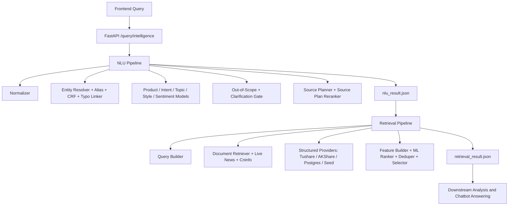

# ARIN Query Intelligence

ARIN Query Intelligence 是本仓库中负责“提问理解”和“证据检索”的模块。它接收前端传入的用户问题，输出两个 JSON：

- `nlu_result.json`: 第一阶段 NLU 结果，包含问题归一化、产品类型、意图、主题、实体、缺失槽位、风险标记、证据需求和 source plan。
- `retrieval_result.json`: 第二阶段检索结果，包含已执行数据源、文档证据、结构化行情/财务/宏观数据、覆盖度、告警和排序调试信息。

本模块不生成最终聊天回复，不做投资结论。下游模块应直接消费这两个 JSON，再进行文档学习、情感分析、趋势分析、数值计算和最终回答生成。

## 支持范围

当前运行范围是中国市场 v1：

- A 股股票：个股行情、新闻、公告、财务、行业、基本面、估值、风险、比较。
- ETF / 基金：净值、定投、费率、申赎、产品机制、ETF/LOF/指数基金比较。
- 指数 / 大盘 / 行业板块：沪深300、上证指数、白酒板块、半导体板块等。
- 宏观 / 政策 / 指标：CPI、PMI、M2、国债利率、降息、政策影响。
- 金融问法：为什么涨跌、还能不能拿、是否值得入手、哪个好、基本面怎么样、风险如何。

默认不保证港股、美股、海外基金、非中国市场公司名的完整结构化覆盖。如果要支持这些范围，需要补运行时实体库、alias、行情 provider、公告 provider 和相应训练/评测样本。

## 快速运行

请使用 Python 3.13 或兼容的 Python 3 版本。以下命令默认在仓库根目录运行。

```bash
# 人工输入一个问题，并输出两个 JSON 文件
python manual_test/run_manual_query.py

# 直接传入问题
python manual_test/run_manual_query.py --query "你觉得中国平安怎么样？"

# 启动 FastAPI 服务
uvicorn query_intelligence.api.app:create_app --factory --host 0.0.0.0 --port 8000

# 启动时打开 live 数据源
QI_USE_LIVE_MARKET=1 QI_USE_LIVE_NEWS=1 QI_USE_LIVE_ANNOUNCEMENT=1 \
uvicorn query_intelligence.api.app:create_app --factory --host 0.0.0.0 --port 8000
```

人工测试输出目录：

```text
manual_test/output/<timestamp>-<query-slug>/
  query.txt
  nlu_result.json
  retrieval_result.json
```

## API

API 定义在 `query_intelligence/api/app.py`，字段模型定义在 `query_intelligence/contracts.py`。

| Endpoint | 用途 | 输入 | 输出 |
|---|---|---|---|
| `GET /health` | 健康检查 | 无 | `{"status":"ok"}` |
| `POST /nlu/analyze` | 只跑 NLU | `AnalyzeRequest` | `NLUResult` |
| `POST /retrieval/search` | 使用已有 NLU 结果跑检索 | `RetrievalRequest` | `RetrievalResult` |
| `POST /query/intelligence` | 端到端跑 NLU + Retrieval | `PipelineRequest` | `PipelineResponse` |
| `POST /query/intelligence/artifacts` | 端到端运行并落盘两个 JSON | `ArtifactRequest` | `ArtifactResponse` |

### 前端请求 JSON

推荐前端调用 `POST /query/intelligence`。如果需要让服务端直接保存文件，调用 `POST /query/intelligence/artifacts`。

```json
{
  "query": "你觉得中国平安怎么样？",
  "user_profile": {
    "risk_preference": "balanced",
    "preferred_market": "cn",
    "holding_symbols": ["601318.SH"]
  },
  "dialog_context": [
    {
      "role": "user",
      "content": "我持有中国平安"
    },
    {
      "role": "assistant",
      "entities": [
        {
          "symbol": "601318.SH",
          "canonical_name": "中国平安"
        }
      ]
    }
  ],
  "top_k": 10,
  "debug": false
}
```

字段说明：

| 字段 | 类型 | 必填 | 说明 |
|---|---:|---:|---|
| `query` | string | 是 | 用户原始问题。不能为空。 |
| `user_profile` | object | 否 | 用户画像或前端上下文，例如风险偏好、持仓、偏好市场。当前模块只轻量使用，保留给后续增强。 |
| `dialog_context` | array | 否 | 多轮对话上下文。可传上一轮提到的实体、用户持仓、澄清信息。 |
| `top_k` | integer | 否 | 检索输出上限，范围 1 到 100，默认 20。 |
| `debug` | boolean | 否 | 是否输出更多调试痕迹。生产默认 `false`。 |
| `session_id` | string | 仅 artifacts 可用 | 前端会话 ID，用于落盘 manifest。 |
| `message_id` | string | 仅 artifacts 可用 | 前端消息 ID，用于落盘 manifest。 |

`/retrieval/search` 的输入是：

```json
{
  "nlu_result": {
    "...": "完整 NLUResult JSON"
  },
  "top_k": 10,
  "debug": false
}
```

## 输出一：NLUResult

示例：

```json
{
  "query_id": "d5f7941a-d658-40f6-a0e0-25620ce09c73",
  "raw_query": "你觉得中国平安怎么样？",
  "normalized_query": "你觉得中国平安怎么样",
  "question_style": "advice",
  "product_type": {
    "label": "stock",
    "score": 0.99
  },
  "intent_labels": [
    {
      "label": "market_explanation",
      "score": 0.57
    },
    {
      "label": "fundamental_analysis",
      "score": 0.53
    }
  ],
  "topic_labels": [
    {
      "label": "price",
      "score": 0.93
    },
    {
      "label": "fundamentals",
      "score": 0.56
    }
  ],
  "entities": [
    {
      "mention": "中国平安",
      "entity_type": "stock",
      "confidence": 0.99,
      "match_type": "alias_exact",
      "entity_id": 8,
      "canonical_name": "中国平安",
      "symbol": "601318.SH",
      "exchange": "SSE"
    }
  ],
  "comparison_targets": [],
  "keywords": [],
  "time_scope": "unspecified",
  "forecast_horizon": "short_term",
  "sentiment_of_user": "neutral",
  "operation_preference": "unknown",
  "required_evidence_types": ["price", "news", "fundamentals", "risk"],
  "source_plan": ["fundamental_sql", "news", "announcement", "research_note", "market_api"],
  "risk_flags": ["investment_advice_like"],
  "missing_slots": [],
  "confidence": 0.7,
  "explainability": {
    "matched_rules": ["alias_exact: 中国平安->中国平安", "question_style_ml:0.70"],
    "top_features": ["market_explanation", "fundamental_analysis"]
  }
}
```

字段说明：

| 字段 | 类型 | 说明 |
|---|---:|---|
| `query_id` | string | 本次查询 UUID。两个输出 JSON 使用同一个 ID。 |
| `raw_query` | string | 前端传入的原始问题。 |
| `normalized_query` | string | 归一化问题，去除部分标点、统一别名/时间词/操作词。 |
| `question_style` | enum | 问句类型：`fact`、`why`、`compare`、`advice`、`forecast`。 |
| `product_type` | object | 单标签产品类型预测，含 `label` 和置信度 `score`。 |
| `intent_labels` | array | 多标签意图预测，每项为 `{label, score}`。 |
| `topic_labels` | array | 多标签主题预测，每项为 `{label, score}`。 |
| `entities` | array | 实体识别和链接结果。A 股/ETF/基金/指数应尽量带 `symbol`。 |
| `comparison_targets` | array | 比较型问题中的目标，如“沪深300”“上证50”。 |
| `keywords` | array | 检索关键词。 |
| `time_scope` | enum | 时间范围：`today`、`recent_3d`、`recent_1w`、`recent_1m`、`recent_1q`、`long_term`、`unspecified`。 |
| `forecast_horizon` | string | 预测或持有周期，例如 `short_term`、`long_term`。 |
| `sentiment_of_user` | string | 用户语气情绪，通常为 `positive`、`neutral`、`negative`。 |
| `operation_preference` | enum | 用户操作倾向：`buy`、`sell`、`hold`、`reduce`、`observe`、`unknown`。 |
| `required_evidence_types` | array | 下游需要的证据类型，如 `price`、`news`、`fundamentals`、`risk`、`industry`。 |
| `source_plan` | array | 检索阶段应执行的数据源类型。 |
| `risk_flags` | array | 风险标记，如 `investment_advice_like`、`out_of_scope_query`、`entity_not_found`。 |
| `missing_slots` | array | 缺失槽位，如 `missing_entity`。存在关键缺失时检索会早退或只输出告警。 |
| `confidence` | float | NLU 总体置信度。 |
| `explainability` | object | 可解释信息：命中的规则、模型特征、实体匹配依据。 |

常见标签：

| 类别 | 标签 |
|---|---|
| `product_type` | `stock`、`etf`、`fund`、`index`、`macro`、`generic_market`、`unknown`、`out_of_scope` |
| `intent_labels` | `price_query`、`market_explanation`、`hold_judgment`、`buy_sell_timing`、`product_info`、`risk_analysis`、`peer_compare`、`fundamental_analysis`、`valuation_analysis`、`macro_policy_impact`、`event_news_query`、`trading_rule_fee` |
| `topic_labels` | `price`、`news`、`industry`、`macro`、`policy`、`fundamentals`、`valuation`、`risk`、`comparison`、`product_mechanism` |
| `source_plan` | `market_api`、`news`、`industry_sql`、`fundamental_sql`、`announcement`、`research_note`、`faq`、`product_doc`、`macro_sql` |

## 输出二：RetrievalResult

示例：

```json
{
  "query_id": "d5f7941a-d658-40f6-a0e0-25620ce09c73",
  "nlu_snapshot": {
    "product_type": "stock",
    "intent_labels": ["market_explanation", "fundamental_analysis"],
    "entities": ["601318.SH"],
    "source_plan": ["fundamental_sql", "news", "announcement", "research_note", "market_api"]
  },
  "executed_sources": ["news", "announcement", "research_note", "market_api", "fundamental_sql"],
  "documents": [
    {
      "evidence_id": "aknews_601318.SH_1",
      "source_type": "news",
      "source_name": "证券时报网",
      "source_url": "http://finance.eastmoney.com/a/example.html",
      "provider": "证券时报网",
      "title": "中国平安估值修复预期升温",
      "summary": "保险板块估值修复预期增强。",
      "text_excerpt": "保险板块估值修复预期增强。",
      "body": "完整或截断后的正文片段。",
      "body_available": true,
      "publish_time": "2026-04-23T20:17:00",
      "retrieved_at": "2026-04-24T06:05:34.453912+00:00",
      "entity_hits": ["601318.SH"],
      "retrieval_score": 0.5,
      "rank_score": 0.2789,
      "reason": ["entity_exact_match", "alias_match", "title_hit"],
      "payload": null
    }
  ],
  "structured_data": [
    {
      "evidence_id": "price_601318.SH",
      "source_type": "market_api",
      "source_name": "akshare_sina",
      "source_url": null,
      "provider": "akshare_sina",
      "provider_endpoint": "akshare.stock_zh_a_hist",
      "query_params": {
        "symbol": "601318",
        "adjust": "qfq"
      },
      "source_reference": "provider://akshare_sina/stock_zh_a_hist",
      "as_of": "2026-04-23",
      "period": "2026-04-23",
      "field_coverage": {
        "total_fields": 14,
        "non_null_fields": 14,
        "missing_fields": []
      },
      "quality_flags": [],
      "retrieved_at": "2026-04-24T06:05:34.453912+00:00",
      "payload": {
        "symbol": "601318.SH",
        "trade_date": "2026-04-23",
        "open": 53.22,
        "high": 53.88,
        "low": 52.95,
        "close": 53.61,
        "pct_change_1d": 0.73,
        "volume": 124000000,
        "amount": 6640000000,
        "history": []
      }
    }
  ],
  "evidence_groups": [
    {
      "group_id": "group_aknews_601318.SH_1",
      "group_type": "single",
      "members": ["aknews_601318.SH_1"]
    }
  ],
  "coverage": {
    "price": true,
    "news": true,
    "industry": false,
    "fundamentals": true,
    "announcement": true,
    "product_mechanism": false,
    "macro": false,
    "risk": true,
    "comparison": false
  },
  "coverage_detail": {
    "price_history": true,
    "financials": true,
    "valuation": true,
    "industry_snapshot": false,
    "fund_nav": false,
    "fund_fee": false,
    "fund_redemption": false,
    "fund_profile": false,
    "index_daily": false,
    "index_valuation": false,
    "macro_indicator": false,
    "policy_event": false
  },
  "warnings": [],
  "retrieval_confidence": 0.4,
  "debug_trace": {
    "candidate_count": 23,
    "after_dedup": 6,
    "top_ranked": ["aknews_601318.SH_1"]
  }
}
```

顶层字段：

| 字段 | 类型 | 说明 |
|---|---:|---|
| `query_id` | string | 与 NLU 结果一致。 |
| `nlu_snapshot` | object | 检索时使用的 NLU 关键信息快照，方便下游追溯。 |
| `executed_sources` | array | 实际执行过的数据源。可能少于 `source_plan`，例如缺 token 或实体不足。 |
| `documents` | array | 非结构化文档证据：新闻、公告、研报、FAQ、产品文档。 |
| `structured_data` | array | 结构化数据证据：行情、财务、行业、宏观、基金净值/费率/申赎、指数估值。 |
| `evidence_groups` | array | 去重或聚类后的证据组。 |
| `coverage` | object | 高层覆盖度，告诉下游哪些证据类型已覆盖。 |
| `coverage_detail` | object | 更细粒度覆盖度。 |
| `warnings` | array | 检索告警，如 `out_of_scope_query`、`announcement_not_found_recent_window`。 |
| `retrieval_confidence` | float | 检索阶段总体置信度。 |
| `debug_trace` | object | 候选数量、去重后数量、最终 top ranked evidence IDs。 |

`documents[]` 字段：

| 字段 | 说明 |
|---|---|
| `evidence_id` | 证据唯一 ID。 |
| `source_type` | `news`、`announcement`、`research_note`、`faq`、`product_doc` 等。 |
| `source_name` | 数据源名称，例如 `cninfo`、`akshare_sina`、`证券时报网`。 |
| `source_url` | 网页或 PDF URL。研报训练集可能是 `dataset://...` 标识。 |
| `provider` | 实际 provider 名称。 |
| `title` | 文档标题。 |
| `summary` | 摘要。 |
| `text_excerpt` | 可供下游快速阅读的短文本。 |
| `body` | 正文或正文片段。可能经过截断。 |
| `body_available` | 是否有正文内容。 |
| `publish_time` | 发布时间。 |
| `retrieved_at` | 本次检索时间。 |
| `entity_hits` | 命中的实体 symbol 或实体名。 |
| `retrieval_score` | 初召回分。 |
| `rank_score` | 重排后分数。 |
| `reason` | 入选原因，例如 `entity_exact_match`、`alias_match`、`title_hit`。 |
| `payload` | 原始扩展字段，当前通常为空。 |

`structured_data[]` 字段：

| 字段 | 说明 |
|---|---|
| `evidence_id` | 结构化证据唯一 ID，例如 `price_688256.SH`。 |
| `source_type` | `market_api`、`fundamental_sql`、`industry_sql`、`macro_sql`。 |
| `source_name` | 结构化数据源名称，例如 `akshare_sina`、`tushare`、`seed`。 |
| `source_url` | 如果结构化数据有公开页面 URL，则填 URL；纯 API 数据可为空。 |
| `provider` | provider 名称。 |
| `provider_endpoint` | 实际 API 或函数入口，例如 `akshare.stock_zh_a_hist`、`tushare.daily`。 |
| `query_params` | provider 查询参数，例如 symbol、date、adjust。 |
| `source_reference` | 可追溯来源引用，例如 `provider://akshare_sina/stock_zh_a_hist`。 |
| `as_of` | 数据截至日期。 |
| `period` | 数据所属报告期或交易日。 |
| `field_coverage` | 字段完整性统计：总字段数、非空字段数、缺失字段列表。 |
| `quality_flags` | 数据质量标记，如 `seed_source`、`missing_source_url`、`missing_values`。 |
| `retrieved_at` | 本次检索时间。 |
| `payload` | 结构化数据主体，下游模型应主要读取这里。 |

## 架构



主要模块：

| 路径 | 说明 |
|---|---|
| `query_intelligence/api/app.py` | FastAPI 入口。 |
| `query_intelligence/service.py` | `QueryIntelligenceService`，串联 NLU 和 Retrieval。 |
| `query_intelligence/contracts.py` | Pydantic 请求/响应模型。 |
| `query_intelligence/config.py` | 环境变量配置。 |
| `query_intelligence/data_loader.py` | 实体、alias、文档、结构化 seed 数据加载。 |
| `query_intelligence/nlu/pipeline.py` | NLU 主链路。 |
| `query_intelligence/retrieval/pipeline.py` | 检索主链路。 |
| `query_intelligence/integrations/` | Tushare、AKShare、巨潮、efinance provider。 |
| `query_intelligence/external_data/` | 公开数据集同步、标准化、训练资产构建。 |
| `training/` | 全部 ML 模型训练脚本。 |
| `scripts/` | 数据同步、runtime materialize、评估、live provider 验证脚本。 |
| `schemas/` | 输出 JSON Schema。 |

## 训练数据集

公开数据集注册表在 `query_intelligence/external_data/registry.py`。同步后的原始数据在 `data/external/raw/`，标准化训练资产在 `data/training_assets/`。

当前训练报告 `data/training_assets/training_report.json` 中的可用规模：

| 资产 | 样本数 |
|---|---:|
| `classification.jsonl` | 879,793 |
| `entity_annotations.jsonl` | 97,382 |
| `retrieval_corpus.jsonl` | 402,468 |
| `qrels.jsonl` | 2,661,680 |
| `alias_catalog.jsonl` | 10,395 |
| `source_plan_supervision.jsonl` | 225,000 |
| `clarification_supervision.jsonl` | 200,000 |
| `out_of_scope_supervision.jsonl` | 260,000 |
| `typo_supervision.jsonl` | 10,395 |

主要数据源：

| source_id | 类型 | 来源 | 主要用途 |
|---|---|---|---|
| `cflue` | GitHub | `https://github.com/aliyun/cflue` | 金融分类、QA、意图/主题增强 |
| `fiqa` | HuggingFace | `BeIR/fiqa` | 检索、qrels、LTR |
| `finfe` | HuggingFace | `FinanceMTEB/FinFE` | 金融情感 |
| `chnsenticorp` | HuggingFace | `lansinuote/ChnSentiCorp` | 中文情感 |
| `fin_news_sentiment` | GitHub | 金融新闻情感分类数据集 | 金融情感 |
| `msra_ner` | HuggingFace | `levow/msra_ner` | NER/CRF |
| `peoples_daily_ner` | HuggingFace | `peoples_daily_ner` | NER/CRF |
| `cluener` | GitHub | `https://github.com/CLUEbenchmark/CLUENER2020` | NER/CRF |
| `tnews` | HuggingFace | `clue/clue`, config `tnews` | 产品类型、OOD/泛化 |
| `thucnews` | direct HTTP | THUCNews | 分类、意图、主题、OOD |
| `finnl` | GitHub | `BBT-FinCUGE-Applications` | 金融分类、主题 |
| `mxode_finance` | HuggingFace | `Mxode/IndustryInstruction-Chinese` | 金融指令、意图/主题 |
| `baai_finance_instruction` | HuggingFace | `BAAI/IndustryInstruction_Finance-Economics` | 金融指令、意图/主题 |
| `qrecc` | HuggingFace | `slupart/qrecc` | 多轮/澄清/上下文 |
| `risawoz` | HuggingFace | `GEM/RiSAWOZ` | 多轮/非金融对话/OOD |
| `t2ranking` | HuggingFace | `THUIR/T2Ranking` | 中文检索、qrels、LTR |
| `fincprg` | HuggingFace | `valuesimplex-ai-lab/FinCPRG` | 金融检索、研报/语料 |
| `fir_bench_reports` | HuggingFace | `FIR-Bench-Research-Reports-FinQA` | 研报检索、source plan、ranker |
| `fir_bench_announcements` | HuggingFace | `FIR-Bench-Announcements-FinQA` | 公告检索、source plan、ranker |
| `csprd` | GitHub | `https://github.com/noewangjy/csprd_dataset` | 金融检索、qrels |
| `smp2017` | GitHub | `https://github.com/HITlilingzhi/SMP2017ECDT-DATA` | 中文意图/分类 |
| `curated_boundary_cases` | 本地生成 | `scripts/materialize_curated_boundary_cases.py` | 边界样本和回归样本 |

注意：训练资产不等于线上运行库。训练集用于训练模型；线上实体识别、alias、文档召回、结构化数据还需要运行时资产和 live provider。

## 线上检索页面、API 和信息来源

| source_type | provider | 来源 / endpoint | 输出位置 | 说明 |
|---|---|---|---|---|
| `market_api` | Tushare | `tushare.daily` | `structured_data[].payload` | 需要 `TUSHARE_TOKEN`。 |
| `fundamental_sql` | Tushare | `tushare.fina_indicator` | `structured_data[].payload` | 财务指标，优先级高于 fallback。 |
| `market_api` | AKShare | `akshare.stock_zh_a_hist`、`stock_zh_a_daily`、Sina 行情、efinance fallback | `structured_data[].payload` | 无 token fallback。 |
| `fundamental_sql` | AKShare | `akshare.stock_financial_analysis_indicator` | `structured_data[].payload` | 财务指标 fallback。 |
| `industry_sql` | AKShare | `akshare.stock_individual_info_em`、`stock_board_industry_hist_em` | `structured_data[].payload` | 行业归属和行业快照。 |
| `news` | AKShare / 东方财富新闻 | `akshare.stock_news_em` | `documents[]` | 对有效 A 股/ETF 代码返回网页 URL。 |
| `news` | Tushare | `tushare.major_news` | `documents[]` | 可能只有标题/正文片段，无网页 URL。 |
| `announcement` | Cninfo | `https://www.cninfo.com.cn/new/hisAnnouncement/query` | `documents[]` | 公告元数据。 |
| `announcement` | Cninfo static | `https://static.cninfo.com.cn/...PDF` | `documents[].source_url` | 公告 PDF URL。 |
| `macro_sql` | AKShare | `macro_china_cpi_monthly`、`macro_china_pmi_monthly`、`macro_china_money_supply`、`bond_zh_us_rate` | `structured_data[]` | CPI、PMI、M2、利率。 |
| `fund/etf` | AKShare | `fund_etf_hist_em`、`fund_open_fund_info_em`、`fund_individual_detail_info_xq` | `structured_data[]` | ETF/基金净值、费率、申赎、产品信息。 |
| `index` | AKShare | `stock_zh_index_daily`、`stock_zh_index_value_csindex` | `structured_data[]` | 指数行情和估值。 |
| `research_note` | 本地 runtime / FIR/FinCPRG | `data/runtime/documents.jsonl`、`dataset://...` | `documents[]` | 研报/研究文本，部分来源只有数据集引用。 |
| `faq` / `product_doc` | 本地 runtime / seed | `data/runtime/documents.jsonl`、`data/documents.json` | `documents[]` | 产品机制、费用、申赎文档。 |
| optional | PostgreSQL | `QI_POSTGRES_DSN` | `documents[]` / `structured_data[]` | 可接生产文档库和结构化库。 |

结构化数据如果来自纯 API，`source_url` 可以为空，但必须尽量提供 `provider_endpoint`、`query_params`、`source_reference`，保证下游可追溯。

## 环境变量

| 变量 | 默认值 | 说明 |
|---|---|---|
| `TUSHARE_TOKEN` | 空 | Tushare token。存在时可优先使用 Tushare 行情/财务/新闻。 |
| `QI_POSTGRES_DSN` | 空 | PostgreSQL DSN。 |
| `CNINFO_ANNOUNCEMENT_URL` | 巨潮默认查询 URL | 巨潮公告查询 endpoint。 |
| `CNINFO_STATIC_BASE` | `https://static.cninfo.com.cn/` | 巨潮 PDF base URL。 |
| `QI_HTTP_TIMEOUT_SECONDS` | `15` | live provider HTTP 超时。 |
| `QI_USE_LIVE_MARKET` | `false` | 开启 live 行情/财务 provider。 |
| `QI_USE_LIVE_NEWS` | 跟随 `QI_USE_LIVE_MARKET` | 开启 live 新闻。 |
| `QI_USE_LIVE_ANNOUNCEMENT` | 跟随 `QI_USE_LIVE_MARKET` | 开启巨潮公告。 |
| `QI_USE_LIVE_MACRO` | `false` | 开启 live 宏观指标。 |
| `QI_USE_POSTGRES_RETRIEVAL` | `false` | 开启 PostgreSQL 检索/结构化读取。 |
| `QI_MODELS_DIR` | `models` | 模型目录。 |
| `QI_TRAINING_MANIFEST` | 空 | 指定训练 manifest。 |
| `QI_TRAINING_DATASET` | 空 | 指定旧版训练 CSV/JSONL。 |
| `QI_ENABLE_EXTERNAL_DATA` | `false` | 是否允许同步公开数据集。 |
| `QI_DATASET_ALLOWLIST` | 空 | 逗号分隔数据集白名单。 |
| `QI_ENABLE_TRANSLATION` | `false` | 构建资产时是否启用翻译。 |
| `QI_FORCE_REFRESH_DATA` | `false` | 强制刷新数据。 |
| `QI_API_OUTPUT_DIR` | `outputs/query_intelligence` | artifacts API 输出目录。 |
| `QI_ENTITY_MASTER_PATH` | 自动选择 | 覆盖实体主表路径。 |
| `QI_ALIAS_TABLE_PATH` | 自动选择 | 覆盖 alias 表路径。 |
| `QI_DOCUMENTS_PATH` | 自动选择 | 覆盖文档库路径。 |

运行时加载优先级：

- 实体主表：`QI_ENTITY_MASTER_PATH` > `data/runtime/entity_master.csv` > `data/entity_master.csv`
- Alias 表：`QI_ALIAS_TABLE_PATH` > `data/runtime/alias_table.csv` > `data/alias_table.csv`
- 文档库：`QI_DOCUMENTS_PATH` > `data/runtime/documents.jsonl` / `.json` > `data/documents.json`
- 结构化 seed：`data/structured_data.json`

## 数据同步和训练资产构建

只同步公开数据集：

```bash
QI_ENABLE_EXTERNAL_DATA=1 python -m scripts.sync_public_datasets
```

只同步部分数据集：

```bash
QI_ENABLE_EXTERNAL_DATA=1 QI_DATASET_ALLOWLIST=finfe,t2ranking,fir_bench_reports \
python -m scripts.sync_public_datasets
```

将 raw 数据构建为训练资产：

```bash
python -m scripts.build_training_assets
```

输出：

```text
data/training_assets/
  manifest.json
  training_report.json
  classification.jsonl
  entity_annotations.jsonl
  retrieval_corpus.jsonl
  qrels.jsonl
  alias_catalog.jsonl
  source_plan_supervision.jsonl
  clarification_supervision.jsonl
  out_of_scope_supervision.jsonl
  typo_supervision.jsonl
```

端到端同步、构建、预检、训练：

```bash
QI_ENABLE_EXTERNAL_DATA=1 python -m training.sync_and_train
```

已有 manifest 时直接训练：

```bash
python -m training.train_all data/training_assets/manifest.json
```

区别：

- `training.sync_and_train`: 会先同步公开数据集、重建训练资产、跑训练预检，再训练全部模型。
- `training.train_all <manifest>`: 不下载、不重建资产，只按现有 manifest 训练全部模型。

训练前预检：

```bash
python -m training.prepare_training_run data/training_assets/manifest.json models
```

预检报告：

```text
data/training_assets/preflight_report.json
```

## 所有训练脚本

全部训练脚本都会输出进度条、已处理 batch、elapsed 和 ETA。

| 模型 | 脚本 | 输出 |
|---|---|---|
| 产品类型分类器 | `python -m training.train_product_type data/training_assets/manifest.json` | `models/product_type.joblib` |
| 意图多标签分类器 | `python -m training.train_intent data/training_assets/manifest.json` | `models/intent_ovr.joblib` |
| 主题多标签分类器 | `python -m training.train_topic data/training_assets/manifest.json` | `models/topic_ovr.joblib` |
| 问句类型分类器 | `python -m training.train_question_style data/training_assets/manifest.json` | `models/question_style.joblib` |
| 用户情感分类器 | `python -m training.train_sentiment data/training_assets/manifest.json` | `models/sentiment.joblib` |
| 实体边界 CRF | `python -m training.train_entity_crf data/training_assets/manifest.json` | `models/entity_crf.joblib` |
| 澄清 gate | `python -m training.train_clarification_gate data/training_assets/manifest.json` | `models/clarification_gate.joblib` |
| 问句类型 reranker | `python -m training.train_question_style_reranker data/training_assets/manifest.json` | `models/question_style_reranker.joblib` |
| source plan reranker | `python -m training.train_source_plan_reranker data/training_assets/manifest.json` | `models/source_plan_reranker.joblib` |
| OOD / out-of-scope 检测器 | `python -m training.train_out_of_scope_detector data/training_assets/manifest.json` | `models/out_of_scope_detector.joblib` |
| 文档 ranker | `python -m training.train_ranker data/training_assets/manifest.json` | `models/ranker.joblib` |
| typo linker | `python -m training.train_typo_linker data/training_assets/manifest.json` | `models/typo_linker.joblib` |
| 全量训练 | `python -m training.train_all data/training_assets/manifest.json` | 全部 `models/*.joblib` |
| 同步并全量训练 | `QI_ENABLE_EXTERNAL_DATA=1 python -m training.sync_and_train` | 全部 `models/*.joblib` |

## 线上实体库、alias 和文档库填充

训练完成后，还要更新运行时资产，否则会出现“模型训练过但线上实体搜不到”的问题。

### 实体库和 alias

```bash
python -m scripts.materialize_runtime_entity_assets
```

常用参数：

```bash
python -m scripts.materialize_runtime_entity_assets \
  --seed-dir data \
  --training-assets-dir data/training_assets \
  --output-dir data/runtime \
  --max-training-pairs 80000
```

不访问 AKShare，只用本地训练资产：

```bash
python -m scripts.materialize_runtime_entity_assets --no-akshare
```

输出：

```text
data/runtime/entity_master.csv
data/runtime/alias_table.csv
```

填充来源：

- `data/entity_master.csv`
- `data/alias_table.csv`
- `data/training_assets/alias_catalog.jsonl`
- 可选 AKShare A 股/ETF/指数 universe

### 文档库

```bash
python -m scripts.materialize_runtime_document_assets
```

常用参数：

```bash
python -m scripts.materialize_runtime_document_assets \
  --corpus-path data/training_assets/retrieval_corpus.jsonl \
  --output-path data/runtime/documents.jsonl \
  --max-documents 50000
```

输出：

```text
data/runtime/documents.jsonl
```

文档库用于本地 `DocumentRetriever`，包含新闻、公告、研报、产品文档、FAQ 等可召回文本。

### 结构化数据

结构化数据有三层：

1. `data/structured_data.json`: seed fallback，适合离线测试。
2. live provider: Tushare / AKShare / Cninfo / efinance，适合生产或联网环境。
3. PostgreSQL: 生产库接入，适合稳定线上部署。

生产建议：

- A 股行情和财务：优先 `TUSHARE_TOKEN`，无 token 时 fallback 到 AKShare。
- 新闻：开启 `QI_USE_LIVE_NEWS=1`，A 股/ETF 代码走 AKShare/东方财富 URL。
- 公告：开启 `QI_USE_LIVE_ANNOUNCEMENT=1`，走巨潮并按证券代码过滤。
- 宏观：开启 `QI_USE_LIVE_MACRO=1`。
- 生产文档和结构化数据：配置 `QI_USE_POSTGRES_RETRIEVAL=1` 和 `QI_POSTGRES_DSN`。

验证 live 数据源：

```bash
QI_USE_LIVE_MARKET=1 QI_USE_LIVE_NEWS=1 QI_USE_LIVE_ANNOUNCEMENT=1 \
python -m scripts.verify_live_sources --query "你觉得寒武纪值得入手吗" --debug
```

## 测试和评估

推荐交接时按以下顺序执行。

### 快速单元/回归测试

```bash
python -m pytest tests/test_query_intelligence.py tests/test_real_integrations.py -q
```

人工测试脚本测试：

```bash
python -m pytest tests/test_manual_query.py tests/test_manual_test_runner.py -q
```

核心 ML 升级回归：

```bash
python -m pytest tests/test_ml_upgrades.py -q
```

如果一个失败后不想从头跑：

```bash
python -m pytest tests/test_ml_upgrades.py -q --lf
```

如果想一次性看到所有失败，不在第一个失败处停止：

```bash
python -m pytest tests/test_ml_upgrades.py -q
```

### 分组测试

```bash
python -m scripts.run_test_suite
```

分组：

- `data_assets`: 数据资产完整性。
- `adapters_assets`: 外部数据适配器和训练资产构建。
- `core_nlu_retrieval`: NLU 和检索核心测试。
- `manual_and_fuzz`: 人工脚本和 fuzz 评测。
- `real_integrations`: live provider / integration 测试。

### 10k 全量评估

```bash
python -m scripts.evaluate_query_intelligence
```

输出：

```text
reports/2026-04-23-full-stack-eval.json
reports/2026-04-23-full-stack-eval.md
```

评估覆盖：

- 10,000 条中英文、金融、非金融、边界、刁钻问法。
- NLU 指标：金融域召回、OOD 拒识、产品类型、问句类型、意图 F1、主题 F1、澄清召回。
- 检索指标：source plan hit/recall/support、retrieval recall@10、MRR@10、NDCG@10、OOD retrieval abstention。

关键阈值在 `scripts/evaluate_query_intelligence.py` 中维护。若某项不达标，应优先导出错误样本、分类型分析、补训练资产或 runtime 资产，再重训和复评。

### Live source 验证

```bash
python -m scripts.verify_live_sources --query "你觉得中国平安怎么样？" --debug
```

检查项：

- 新闻是否有网页 URL。
- 公告是否有巨潮 PDF URL。
- 行情和财务是否来自 live provider 而不是 `seed`。
- `provider_endpoint`、`query_params`、`source_reference` 是否可追溯。

## 交接调试清单

新同事接手时建议按这个顺序排查：

1. 先跑 `manual_test/run_manual_query.py`，确认能输出两个 JSON。
2. 检查 NLU 是否识别实体。如果实体缺失，先看 `data/runtime/entity_master.csv` 和 `data/runtime/alias_table.csv` 是否已 materialize。
3. 检查 `product_type` 是否正确。如果股票被判 OOD，先看 out-of-scope 训练集和 alias/runtime 实体库。
4. 检查 `source_plan` 是否合理。股票 advice 问法应优先包含 `market_api`、`fundamental_sql`、`news`、`announcement`、`research_note`、`industry_sql`，不应无故包含 `faq` / `product_doc`。
5. 检查 `executed_sources` 是否少于 `source_plan`。如果少，通常是 live provider 未开启、无 token、实体无 symbol、或无可召回文档。
6. 检查 `documents[].source_url`。新闻和公告应尽量有 URL；训练集研报可能只有 `dataset://...`。
7. 检查 `structured_data[].source_name` 和 `provider_endpoint`。生产不应长期只依赖 `seed`。
8. 如果模型表现差，先看 `data/training_assets/training_report.json` 和 `preflight_report.json`，确认监督数据量不为 0。
9. 重训后必须重新跑 10k 评估，不只看单条人工样例。
10. 如果线上部署，需要补 PostgreSQL 文档库/结构化库，并通过 `QI_POSTGRES_DSN` 接入。

## 常见问题

### 为什么训练数据很多，但某只股票还是搜不到？

训练数据只训练模型，不自动进入运行时实体库。需要运行：

```bash
python -m scripts.materialize_runtime_entity_assets
```

并确认 `data/runtime/entity_master.csv`、`data/runtime/alias_table.csv` 中有该实体和别名。

### 为什么 `source_url` 是 null？

对文档证据，新闻和公告应尽量有 URL；研报训练集可能只有 `dataset://...`。对结构化 API 数据，`source_url` 可以为空，但应有 `provider_endpoint`、`query_params`、`source_reference`。

### 为什么 `executed_sources` 没有执行全部 `source_plan`？

常见原因：

- live provider 没开启。
- 没有 `TUSHARE_TOKEN`。
- 实体没有 symbol。
- 对应源没有近期数据。
- 检索 pipeline 对不适合的源做了保护性跳过。

### API 只输出 JSON，不返回自然语言答案，正常吗？

正常。本模块只负责理解和证据检索。最终聊天回答、投资观点措辞、情感分析、趋势分析和指标计算由下游模块完成。

