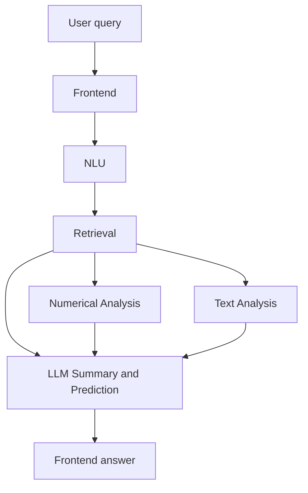

# FinSight Modules

Languages: English | [中文](zh/modules.md)

FinSight is organized into five modules. Each module has a clear responsibility and exchanges structured artifacts with the next stage.

## Module Overview

| Module | Responsibility | Main outputs | Detailed docs |
|---|---|---|---|
| Frontend | Browser interaction, `/chat` request flow, rendered answer cards, evidence display, and bilingual user experience. | Chat UI state, user request, rendered answer, source cards. | [Local Frontend Chatbot](frontend-chatbot.md) |
| NLU and Retrieval | Normalize the query, resolve entities, classify intent/topic/style, plan sources, retrieve documents and structured rows, rank evidence, and package traceable outputs. | `nlu_result`, `retrieval_result`, coverage, warnings, debug trace. | [Query Intelligence](query-intelligence.md) |
| Numerical Analysis | Convert structured market, fundamental, valuation, macro, and price-history rows into compact analytical signals. | `analysis_summary.market_signal`, `fundamental_signal`, `macro_signal`, `data_readiness`. | [Numerical Analysis](numerical-analysis.md) |
| Text Analysis | Clean retrieved documents, detect language, filter entity-relevant sentences, and classify financial sentiment. | `SentimentResult`, document-level `SentimentItem`, entity aggregates. | [Document Sentiment Analysis](sentiment.md) |
| LLM Summary and Prediction | Generate frontend-ready answer JSON and follow-up question suggestions from compact evidence. | `answer_generation`, `next_question_prediction`, citations, disclaimer. | [LLM Response Handoff](llm-response.md) |

## Data Flow

## Boundaries

- The frontend should not infer financial intent or source plans. It sends user input and renders returned evidence.
- NLU and Retrieval should stay explainable and evidence-producing. They do not write final investment answers.
- Numerical analysis summarizes structured evidence. It does not claim causal forecasts.
- Text analysis classifies retrieved documents. It does not retrieve new sources independently.
- LLM summary uses only compact evidence and cited evidence IDs. It must not invent missing facts.

## Where to Change Things

| Task | Start here |
|---|---|
| Add a new endpoint or contract field | `query_intelligence/contracts.py`, then update [Query Intelligence](query-intelligence.md). |
| Add a new source provider | `query_intelligence/integrations/`, retrieval source planning, and provider config. |
| Add a new numerical indicator | `query_intelligence/retrieval/market_analyzer.py`, then update [Numerical Analysis](numerical-analysis.md). |
| Change frontend display | `query_intelligence/chatbot.py`, then update [Local Frontend Chatbot](frontend-chatbot.md). |
| Change sentiment preprocessing or labels | `sentiment/`, then update [Document Sentiment Analysis](sentiment.md). |
| Change LLM JSON output | `scripts/llm_response.py` and `/chat` response mapping, then update [LLM Response Handoff](llm-response.md). |
