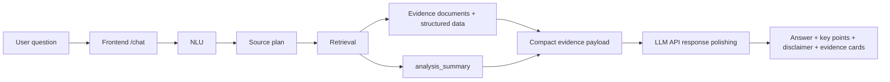

# FinSight Presentation Outline

Use this as the clean source for a short project presentation. It is aligned with the current implementation: Query Intelligence is the explainable backend, while the local browser chatbot is a downstream frontend wrapper.

## 1. Project Motivation

Financial questions are harder than general chatbot questions because they can affect real investment decisions. A useful system must understand ambiguous user intent, retrieve traceable evidence, handle time-sensitive data, and avoid deterministic buy/sell conclusions.

Core problem:

- Users ask broad questions such as "What do you think about Ping An Insurance?"
- The system must infer whether the user needs price movement, fundamentals, news, risk, comparison, or a hold-style judgment.
- The answer should be grounded in market, fundamental, industry, news, announcement, and macro evidence.

## 2. System Boundary

FinSight separates evidence production from answer wording.

Query Intelligence owns:

- Query normalization and language handling.
- Product, intent, topic, style, and out-of-scope detection.
- Entity resolution and source planning.
- Structured and document retrieval.
- Ranking, deduplication, warnings, and `analysis_summary`.

Downstream modules consume those artifacts:

- Local browser chatbot: `GET /` and `POST /chat`.
- LLM API response polishing over compact evidence. DeepSeek is the default provider example, not a hard dependency.
- Sentiment analysis over retrieved documents.
- Optional local-transformers handoff via `scripts/llm_response.py`.

## 3. Architecture



Key implementation paths:

- `query_intelligence/nlu/`
- `query_intelligence/retrieval/`
- `query_intelligence/retrieval/market_analyzer.py`
- `query_intelligence/api/app.py`
- `query_intelligence/chatbot.py`
- `sentiment/`

## 4. Data Sources

Runtime evidence combines shipped assets and live providers:

- Runtime entity and alias tables in `data/runtime/`.
- Runtime document corpus in `data/runtime/documents.jsonl`.
- Market and fundamental providers through AKShare, Tushare, efinance, and seed fallback data.
- Announcement evidence through Cninfo and shipped seed announcements.
- Optional PostgreSQL retrieval for production document stores.

The backend keeps provider warnings in `retrieval_result.warnings` so the frontend can see when live data degraded or fell back.

## 5. Data Mining And ML Methods

The Query Intelligence backbone stays explainable and classical:

- Rules and dictionaries for normalization and source planning.
- TF-IDF and linear classifiers for query classification.
- CRF and alias tables for entity extraction and resolution.
- Tree and ranking models for source planning and retrieval ranking.
- Technical indicators and market features in `analysis_summary`.

Transformer or LLM models are downstream only. They do not replace NLU or retrieval decisions.

## 6. Frontend Demo

Run:

```bash
export DEEPSEEK_API_KEY="your_deepseek_api_key_here"
python scripts/launch_chatbot.py
```

Open:

```text
http://127.0.0.1:8765/
```

Demo queries:

- `你觉得中国平安怎么样？`
- `What do you think about Ping An Insurance (601318.SH)?`
- `Write me a poem`

Expected behavior:

- Financial queries return answer text, key points, evidence cards, and a risk disclaimer.
- English queries receive English output.
- Out-of-scope queries are rejected as non-financial.
- If the configured LLM API is unavailable, the system falls back to a structured evidence summary.

Screenshots:

- Chinese response: `docs/assets/frontend-chatbot-zh.png`
- English response: `docs/assets/frontend-chatbot-en.png`

## 7. Verified Results

Recent local verification:

- `GET /health` returned `{"status":"ok"}`.
- Chinese and English `/chat` test calls returned `llm.status="ok"`.
- Browser UI rendered input, submit button, answer card, key points, evidence sources, and disclaimer.
- `tests/test_chatbot.py` passed.

## 8. Business Value

The system provides an evidence-first financial analysis workflow:

- Reduces hallucination by grounding answers in retrieved artifacts.
- Makes source decisions and provider degradation inspectable.
- Supports bilingual interaction over the same backend artifacts.
- Gives downstream teams stable JSON contracts instead of unstructured chatbot text.

It is not an automated investment advisor. It prepares reliable evidence and risk-aware wording for human review.
