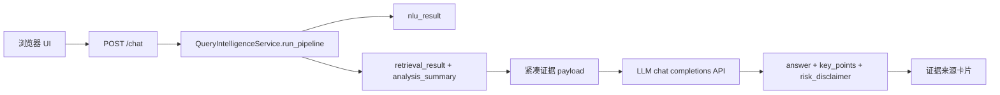

# 本地网页 Chatbot

语言：[English](../frontend-chatbot.md) | 中文

本地网页 Chatbot 是 FinSight 的浏览器演示入口。它刻意保持轻量：前端把用户问题发到 `POST /chat`，后端先跑 Query Intelligence，再把紧凑证据交给 OpenAI-compatible LLM API 生成面向用户的回答措辞。DeepSeek 是当前 checkout 的默认 provider 配置，不是架构边界。

这个包装层不能替代 NLU/Retrieval 主干。实体识别、意图、source plan、证据检索、排序、warnings 和 `analysis_summary` 仍全部来自 Query Intelligence。

## 运行

从 fresh clone 开始：

```bash
pip install -r requirements.txt
export DEEPSEEK_API_KEY="your_deepseek_api_key_here"
python scripts/launch_chatbot.py
```

然后打开：

```text
http://127.0.0.1:8765/
```

如果只是本地演示，希望减少慢速公告 live 请求，可以关闭 live 公告源；本地 seed 公告数据仍可使用：

```bash
QI_USE_LIVE_ANNOUNCEMENT=0 python scripts/launch_chatbot.py
```

## 请求流程



如果没有配置 LLM API、网络不可达或模型返回非法 JSON，`/chat` 会返回结构化摘要 fallback，并把 `llm.status` 标为 `"fallback"`。即使 fallback，响应仍保留 `nlu_result`、`retrieval_result` 和证据来源。

## LLM API 配置

默认值在 `config/app_config.json`，环境变量优先级更高。当前配置命名空间仍叫 `deepseek`，因为 DeepSeek 是随仓库提供的默认示例 provider。架构上客户端调用的是 chat-completions endpoint，可以通过修改 `DEEPSEEK_BASE_URL`、`DEEPSEEK_CHAT_PATH` 和 `DEEPSEEK_MODEL` 指向其他兼容 provider。

| 字段 | 环境变量 | 默认值 |
|---|---|---|
| `deepseek.api_key` | `DEEPSEEK_API_KEY` | 空 |
| `deepseek.base_url` | `DEEPSEEK_BASE_URL` | `https://api.deepseek.com` |
| `deepseek.chat_path` | `DEEPSEEK_CHAT_PATH` | `/chat/completions` |
| `deepseek.model` | `DEEPSEEK_MODEL` | `deepseek-v4-flash` |
| `deepseek.timeout_seconds` | `DEEPSEEK_TIMEOUT_SECONDS` | `60` |
| `deepseek.thinking_type` | `DEEPSEEK_THINKING_TYPE` | `enabled` |
| `deepseek.reasoning_effort` | `DEEPSEEK_REASONING_EFFORT` | `high` |
| `deepseek.max_tokens` | `DEEPSEEK_MAX_TOKENS` | `8192` |

如果需要默认 provider 的更强模型，使用 `DEEPSEEK_MODEL=deepseek-v4-pro`；如果切换 base URL，也可以把它设置为其他兼容 provider 的模型名。支持 reasoning controls 的 provider 可使用 `DEEPSEEK_REASONING_EFFORT=max`。后端请求会发送 `response_format={"type":"json_object"}`，并要求模型只返回一个严格 JSON object。

## API 契约

`POST /chat` 支持和主 pipeline 相同的前端上下文字段：

```json
{
  "query": "你觉得中国平安怎么样？",
  "user_profile": {},
  "dialog_context": [],
  "top_k": 20,
  "debug": false
}
```

响应字段：

| 字段 | 含义 |
|---|---|
| `answer` | LLM API 或 fallback 生成的最终用户回复。 |
| `key_points` | 基于检索证据的简短要点。 |
| `risk_disclaimer` | 投资风险提示。 |
| `evidence_used` | 回答层使用的 evidence IDs。 |
| `evidence_sources` | 前端可直接渲染的来源卡片，包含标题、类型、来源名和可选 URL。 |
| `llm` | `{provider, model, status, error}`，用于观察模型状态。 |
| `nlu_result` | 完整 Query Intelligence NLU 产物。 |
| `retrieval_result` | 完整 Retrieval 产物，包含 warnings 和 `analysis_summary`。 |

## 本地实测

以下截图来自 2026-05-03 的真实本地浏览器运行。服务使用默认 DeepSeek-compatible 配置：`deepseek-v4-flash`、thinking enabled、`reasoning_effort=high`，API key 只通过本地环境变量注入，没有写入仓库。

中文问题：

```text
你觉得中国平安怎么样？
```


英文问题：

```text
What do you think about Ping An Insurance (601318.SH)?
```


实测检查：

| 检查项 | 结果 |
|---|---|
| `GET /health` | `{"status":"ok"}` |
| `POST /chat` 中文问题 | `llm.status="ok"`，中文回答 |
| `POST /chat` 英文问题 | `llm.status="ok"`，英文回答 |
| 浏览器交互 | 输入框、提交按钮、回答卡片、要点、证据来源和免责声明均可渲染 |
| 已修复依赖问题 | 新增 `socksio`，让 `httpx` 能使用本机 SOCKS 代理环境变量 |

## 排错

如果 LLM API fallback 中出现 SOCKS proxy 相关错误，重新安装依赖：

```bash
pip install -r requirements.txt
```

如果 live provider 失败，检查 `retrieval_result.warnings`。pipeline 应该优雅降级，在可用时使用 fallback provider 或仓库自带 runtime assets 继续回答。
