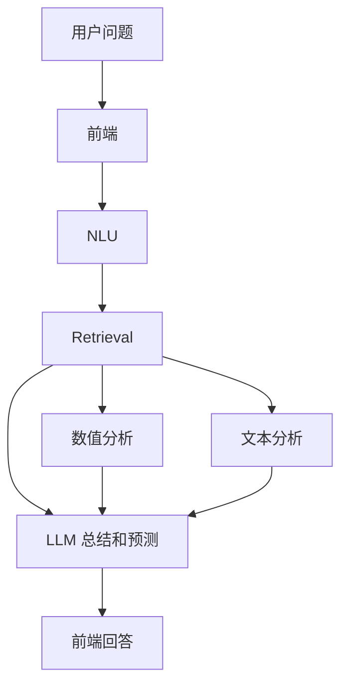

# FinSight 模块

语言：[English](../modules.md) | 中文

FinSight 分为五个模块。每个模块职责明确，并通过结构化产物向下一阶段传递信息。

## 模块总览

| 模块 | 职责 | 主要输出 | 详细文档 |
|---|---|---|---|
| 前端 | 浏览器交互、`/chat` 请求流程、回答卡片、证据展示和中英文体验。 | Chat UI 状态、用户请求、渲染回答、source cards。 | [本地网页 Chatbot](frontend-chatbot.md) |
| NLU 和 Retrieval | 问题归一化、实体解析、意图/主题/问法分类、source plan、文档与结构化检索、证据排序和打包。 | `nlu_result`、`retrieval_result`、coverage、warnings、debug trace。 | [Query Intelligence](query-intelligence.md) |
| 数值分析 | 将行情、基本面、估值、宏观和价格历史行转换为紧凑分析信号。 | `analysis_summary.market_signal`、`fundamental_signal`、`macro_signal`、`data_readiness`。 | [数值分析](numerical-analysis.md) |
| 文本分析 | 清洗检索文档、检测语言、过滤实体相关句子并分类金融情感。 | `SentimentResult`、文档级 `SentimentItem`、实体聚合结果。 | [文档情感分析](sentiment.md) |
| LLM 总结和预测 | 基于紧凑证据生成前端回答 JSON 和后续问题建议。 | `answer_generation`、`next_question_prediction`、引用和风险提示。 | [LLM 回答生成交接](llm-response.md) |

## 数据流

## 边界

- 前端不推断金融意图或 source plan，只发送用户输入并渲染返回证据。
- NLU 和 Retrieval 保持可解释，负责生产证据，不写最终投资回答。
- 数值分析只总结结构化证据，不声称因果预测。
- 文本分析只分类已检索文档，不独立检索新来源。
- LLM 总结只使用紧凑证据和 evidence ID，不编造缺失事实。

## 修改入口

| 任务 | 从这里开始 |
|---|---|
| 新增 endpoint 或契约字段 | `query_intelligence/contracts.py`，然后更新 [Query Intelligence](query-intelligence.md)。 |
| 新增 source provider | `query_intelligence/integrations/`、retrieval source planning 和 provider 配置。 |
| 新增数值指标 | `query_intelligence/retrieval/market_analyzer.py`，然后更新 [数值分析](numerical-analysis.md)。 |
| 修改前端展示 | `query_intelligence/chatbot.py`，然后更新 [本地网页 Chatbot](frontend-chatbot.md)。 |
| 修改情感预处理或标签 | `sentiment/`，然后更新 [文档情感分析](sentiment.md)。 |
| 修改 LLM JSON 输出 | `scripts/llm_response.py` 和 `/chat` 响应映射，然后更新 [LLM 回答生成交接](llm-response.md)。 |
